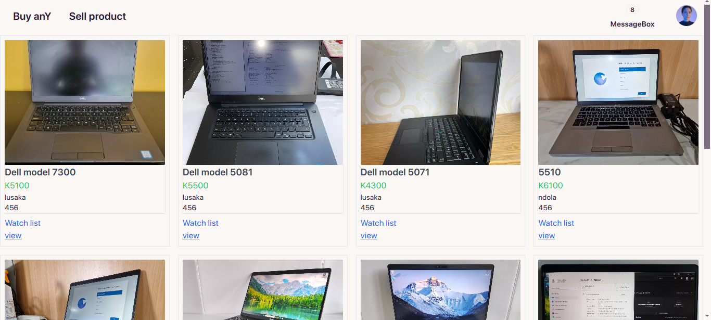
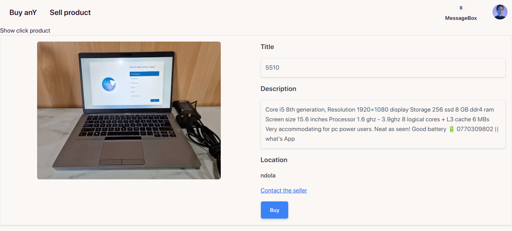
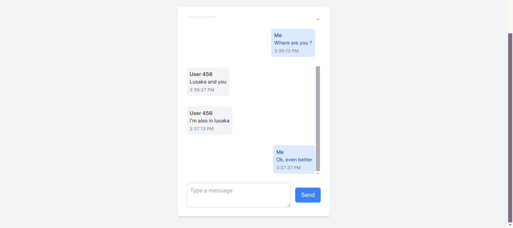

Buyany

Buyany is a comprehensive system designed to streamline the process of buying and selling tech products. It incorporates advanced features such as JSON Web Tokens (JWT) and refresh tokens to ensure secure authentication and authorization.

Key Features

Secure Authentication: Utilizes JWT and refresh tokens to provide enhanced security.

State Management: Built with Redux for efficient state management.

Buyer and Seller Functionalities: Tailored experiences for buyers and sellers to simplify product interactions and communication.

Functionalities

Buyers

Send Messages to Sellers: Buyers can initiate conversations with sellers about listed products.

Message Box: Easily view a list of ongoing conversations with sellers.

Sellers

Post Products: Sellers can list products for buyers to view and interact with.

Message Interaction: View messages from buyers and dynamically respond to their inquiries.

Tech Stack

Frontend: React Framework

Backend: Node.js v21.7.3

State Management: Redux

Authentication: JWT with refresh tokens for added security

Application Pages

Home

The homepage provides an overview of the platform, showcasing featured products and navigation to key sections.

Sell Product

The sell-product page allows sellers to list their products, including images, descriptions, and prices.

View Product

Buyers can view detailed information about a product, including images, descriptions, and seller information.

List of Conversations

This page displays a list of ongoing conversations, allowing buyers and sellers to manage their messages efficiently.

Chat Space

The chat space facilitates real-time communication between buyers and sellers, enabling seamless interaction.

Installation and Setup

Prerequisites

Node.js v21.7.3 or higher

npm package manager

React installed on the client-side
